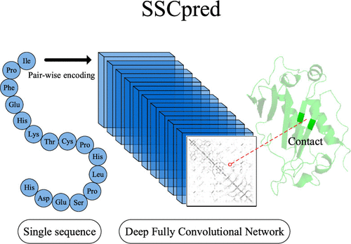

# SSCpred: Single-Sequence-Based Protein Contact Prediction Using Deep Fully Convolutional Network

There has been a significant improvement in protein residue contact prediction in recent years. Nevertheless, state-of-the-art methods still show deficiencies in the contact prediction of proteins with low-homology information. These top methods depend largely on statistical features that derived from homologous sequences, but previous studies, along with our analyses, show that they are insufficient for inferencing an accurate contact map for nonhomology protein targets. To compensate, we proposed a brand new single-sequence-based contact predictor (SSCpred) that performs prediction through the deep fully convolutional network (Deep FCN) with only the target sequence itself, i.e., without additional homology information. The proposed pipeline makes good use of the target sequence by utilizing the pair-wise encoding technique and Deep FCN. Experimental results demonstrated that SSCpred can produce accurate predictions based on the efficient pipeline. Compared with several most recent methods, SSCpred achieves completive performance on nonhomology targets. Overall, we explored the possibilities of single-sequence-based contact prediction and designed a novel pipeline without using a complex and redundant feature set. The proposed SSCpred can compensate for current methods’ disadvantages and achieves better performance on the nonhomology targets. 

# To obtain the contact map predictions for your protein sequences, run

    python3 SSCPred.py --seq your_sequence --i1c the_directory_of_SPIDER3_features

Using the official SPIDER3 code from [SPIDER3's offical Repository](https://github.com/zyxue/SPIDER3) to extract "i1c" feature from single sequence. 

Note that this repository only includes the code and trained parameters for inference.

# Requirement

    Python==3.6.8
    TensorFlow==1.8.0
    Numpy==1.16.3
